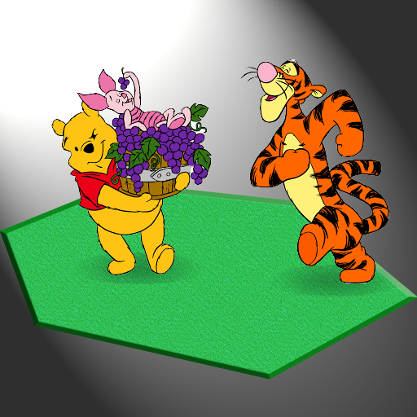

# tGUR-grape-update

For mod: The Great Unciv Rework

Sets the framework for resource icon asset updates, starting with grapes. This mod must be set to perma audiovisual mod, then reload Unciv to take effect.

